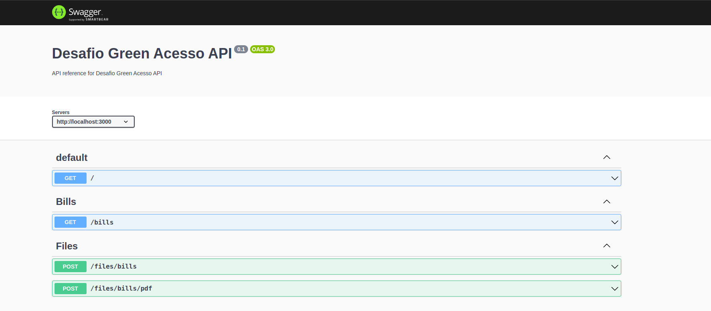
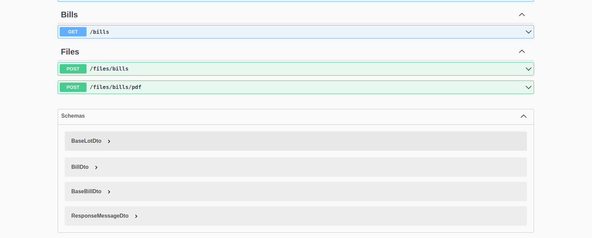

## Descrição
A API foi desenvolvida em TypeScript usando o framework NestJS e executada em um sistema Ubuntu.

## Documentação 
A documentação está completamente em português, incluindo as mensagens de erro da API, para facilitar a integração e se adequar melhor ao sistema. No entanto, o restante do texto está em inglês.

Dentro da pasta "docs", você encontrará o arquivo exportado do Postman, um exemplo de PDF e um exemplo de CSV utilizados durante o processo de criação da API.

Também há a documentação no Swagger. Para acessá-la, basta executar a aplicação e abrir o seguinte endereço em qualquer navegador:

```bash
$ http://localhost:3000/
```

Ao acessar essa URL em seu navegador, você encontrará todas as rotas disponíveis para uso.




## Executando a API
## Executando com Node.js 
Para executar a API, você deve ter o Node.js, o npm e o PostgreSQL instalados em seu computador.

## Arquivo .env
Um exemplo de arquivo .env é fornecido abaixo. No entanto, você precisa atualizar as configurações do banco de dados, como o nome do usuário e a senha. Após criar o banco de dados no PostgreSQL com o seu usuário, siga os demais passos.

```bash
$ DATABASE=desafio
$ DB_USERNAME=nicolas
$ DB_PASSWORD=123456
$ DB_HOST=localhost
$ DB_PORT=5432
```


## Instalação
```bash
$ npm install
```

## Iniciar
```bash
$ npm run start
```

## Test
```bash
# unit tests
$ npm run test
```
